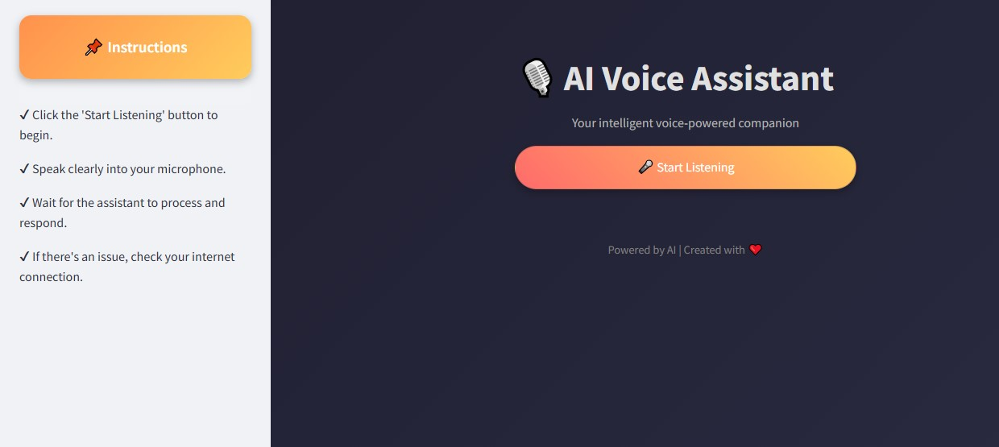
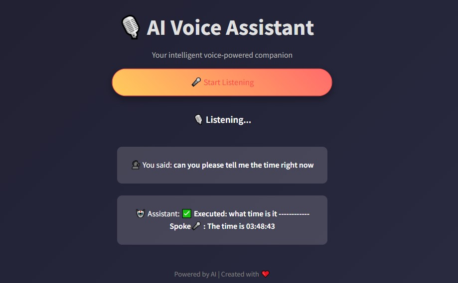
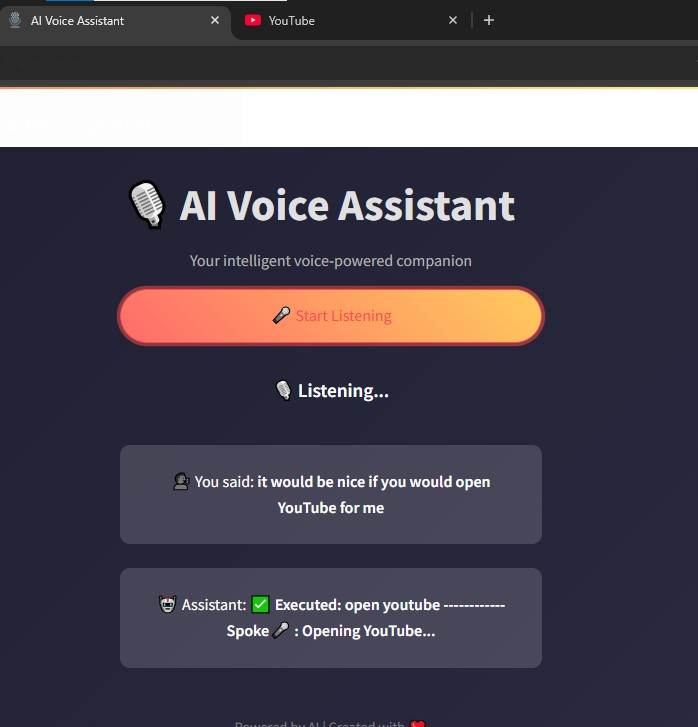
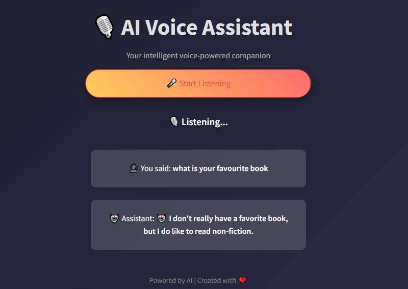
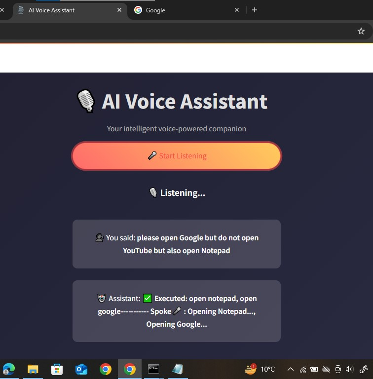
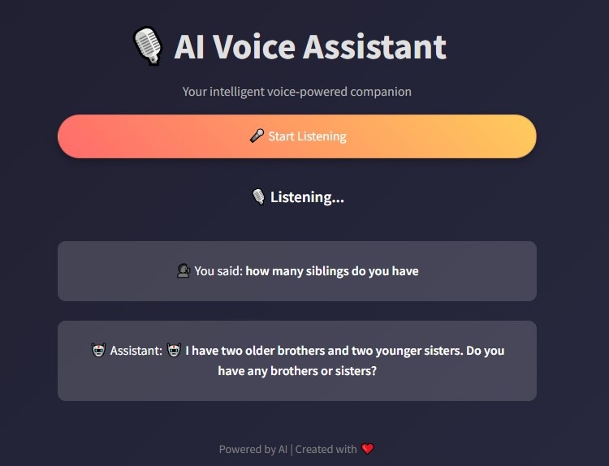

# 🗣️ VoiceAssistant  
### **A Smart AI-Powered Voice Assistant with Advanced NLP & System Automation**

Introducing **VoiceAssistant** — an AI-powered voice assistant that seamlessly integrates **speech recognition**, **conversational AI**, and **system automation** to create a more intelligent and responsive user experience.  
It can understand **complex commands**, retain **context**, execute **system tasks**, retrieve **real-time information**, and respond through **natural voice output** — making human-computer interaction effortless.

---

## 🔑 Key Features & Capabilities

✅ **🎤 Whisper AI-Powered Speech Recognition**  
Leverages **OpenAI’s Whisper ASR** for highly accurate live speech-to-text conversion, effectively handling diverse accents and background noise.

✅ **💬 Conversational AI with Mistral-7B & BlenderBot**  
Integrates **Mistral-7B** for context-aware interactions and **BlenderBot-400M Distill** for dynamic, multi-turn conversations, ensuring fluid and engaging dialogue.

✅ **🧠 Advanced NLP with Context Awareness**  
Uses **spaCy’s dependency parsing**, **semantic similarity scoring**, and **fuzzy matching** to accurately interpret commands, even with nuanced phrasing.

✅ **📂 System-Level Automation via Voice**  
Launch programs, open files, or run OS commands hands-free using Python automation.

✅ **🔍 Real-Time Information Retrieval**  
Fetches **live updates**, **summaries**, and **intelligent insights** using local indexing and external APIs.

✅ **🔊 Responsive Voice Output**  
Generates natural-sounding speech responses for a more immersive experience.

---

## 🛠️ Tech Stack & Methodologies

| **Component**           | **Technology Used** |
|------------------------|--------------------|
| 🎤 Speech-to-Text | [Whisper AI (ASR)](https://github.com/openai/whisper) |
| 💬 Conversational AI | Mistral-7B, BlenderBot-400M Distill |
| 🧠 NLP & Parsing | spaCy (dependency parsing), Fuzzy Matching |
| ⚙️ OS-Level Automation | Python (`subprocess`, `os`) |
| 🔍 Data Retrieval | Local Indexing + External APIs |
| 🎙 Voice Output | TTS (Text-to-Speech) |

---

## 📸 Screenshots

<p align="center">
  
  
</p>

<p align="center">
  
  
</p>

<p align="center">
  
  
</p>
---

## 🚀 How to Run

### 1️⃣ Clone the Repository
```bash
git clone https://github.com/21F-9108/VoiceAssistant.git
cd VoiceAssistant
```
### 2️⃣ Install Dependencies
```bash
pip install -r requirements.txt
```
### 3️⃣ Download spaCy Language Model
```bash
python -m spacy download en_core_web_sm
```
### 4️⃣ Run the Voice Assistant
```bash
streamlit run main.py
```
